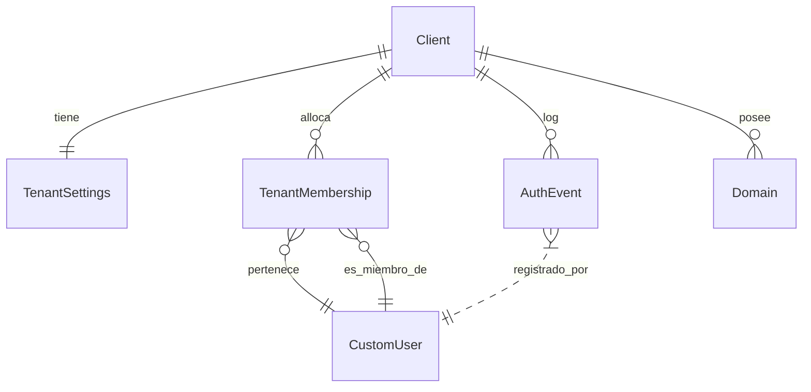

# Diagrama ER de accounts

- `CustomUser` reside en el esquema `public`, pero se relaciona con `TenantMembership` y, a través de ella, con el `Client` del tenant activo.
- `TenantSettings` y `Domain` son 1:1 o 1:N con `Client` y guardan metadata para el SSO y los recordatorios.
- `AuthEvent` registra cada intento de login (password, Google, SSO consume) y apunta a quien lo inició y al tenant correspondiente.
- Este diagrama recuerda que `accounts` no crea nuevos esquemas, sino que regula cómo se distribuyen usuarios desde el hub hacia clientes existentes.
