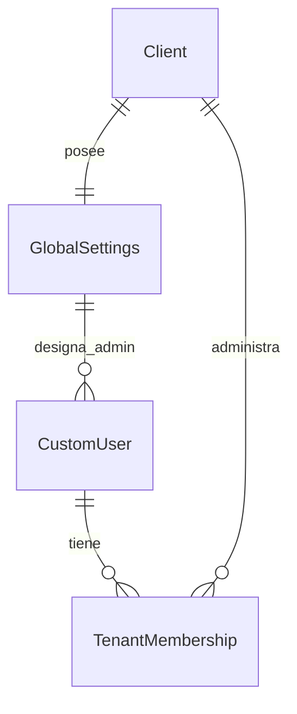

# Diagrama ER de `login`

- `CustomUser` vive en `public` y se registra contra `TenantMembership` para determinar qué tenants puede usar.
- `GlobalSettings` es un singleton por tenant que controla el estado de 2FA, color de menú y administradores.
- Los enlaces explicitan que el módulo no crea nuevos esquemas; sólo enlaza usuarios globales con `Client` y sus settings.
