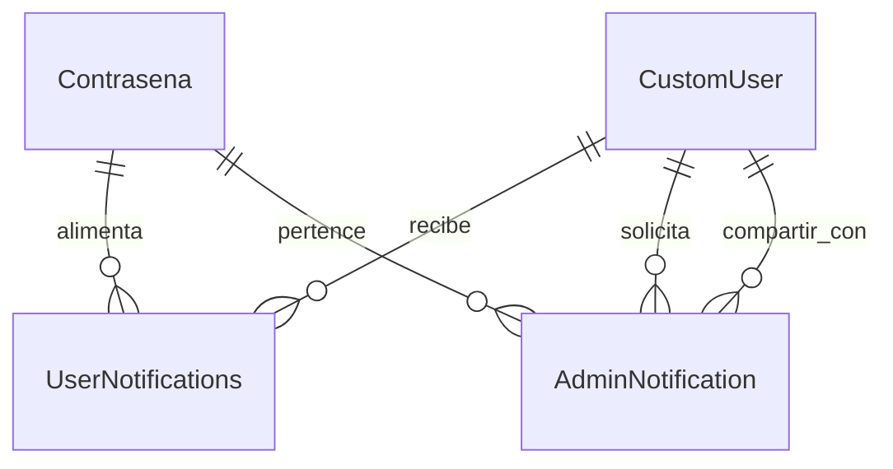

# Diagrama ER de `notifications`

- `UserNotifications` vincula usuarios comunes con la contraseña relacionada y guarda el estado `viewed`.
- `AdminNotification` registra quién solicitó compartir, a quién se pide, qué acción y tipo de usuario (admin/staff).
- El módulo reitera que sólo enlaza `CustomUser` con `Contrasena` por medio de notificaciones; no crea nuevos esquemas.
