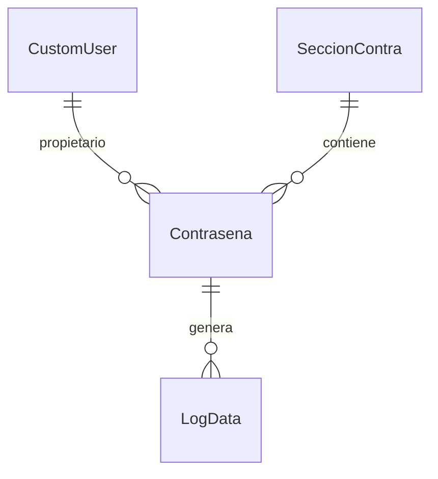

```mermaid
erDiagram
    CustomUser ||--o{ Contrasena : "propietario"
    SeccionContra ||--o{ Contrasena : "contiene"
    Contrasena ||--o{ LogData : "genera"
```

- `Contrasena` referencia a `CustomUser` mediante `owner`.
- `SeccionContra` agrupa `Contrasena` por sección.
- `LogData` contiene auditoría relacionada con acciones sobre `Contrasena`.
