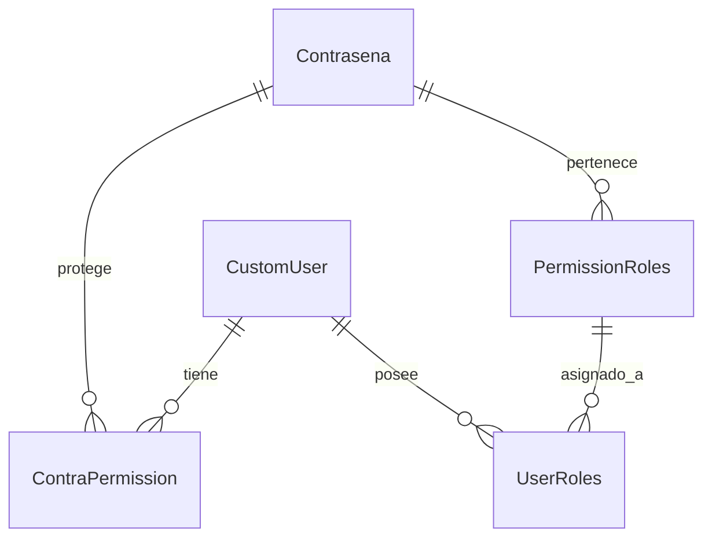

```mermaid
erDiagram
    CustomUser ||--o{ ContraPermission : "tiene"
    Contrasena ||--o{ ContraPermission : "protege"
    Contrasena ||--o{ PermissionRoles : "pertenece"
    PermissionRoles ||--o{ UserRoles : "asignado_a"
    CustomUser ||--o{ UserRoles : "posee"
```

- `ContraPermission` relaciona usuarios y contraseñas con flags de vigencia.
- `PermissionRoles` agrupa `Contrasena` y `UserRoles` persiste la asignación a usuarios.
