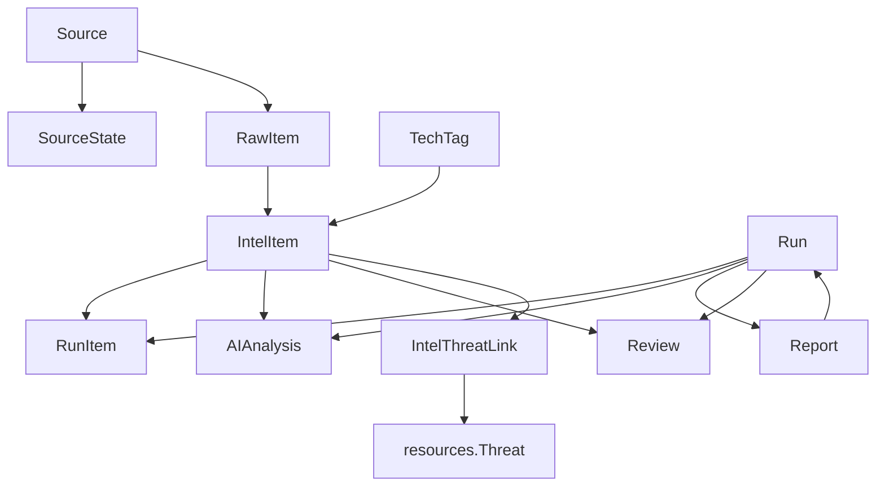

# Diagrama ER de `threat_intel`

Este archivo resume cómo se relacionan los modelos de inteligencia de amenazas, desde la ingesta (`Source` / `RawItem`) hasta las decisiones y reportes que influyen en el resto del sistema.

## Relaciones clave
- `Source` mantiene un `SourceState` con cursores y métricas; alimenta `RawItem` que luego se normaliza en `IntelItem`.
- Cada `Run` genera `RunItem`, `AIAnalysis` y puede producir un `Report` además de `Review` para cada item crítico.
- `AIAnalysis` y `Review` están conectados a `IntelItem` para documentar decisiones automáticas y humanas.
- `IntelThreatLink` enlaza un `IntelItem` con una amenaza de `resources.Threat`, permitiendo la reutilización del catálogo principal.
- `TechTag` clasifica las tecnologías a las que aplica un `IntelItem`.

## Diagrama
